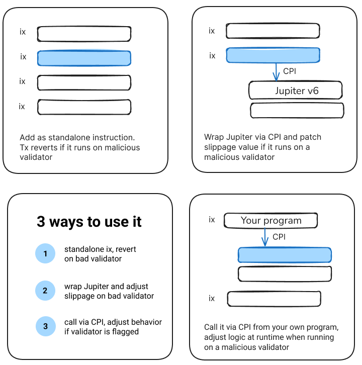

# Anti-Sandwich Toolkit

**Built by the team behind the Solana MEV dashboard [Sandwiched.me](https://sandwiched.me)**

A minimal proof-of-concept demonstrating how Solana applications can **react at runtime when their transaction is routed to a malicious validator**.

---

## Overview

This toolkit provides a single lightweight primitive that enables applications to take defensive action when detected on a malicious validator. Your application can either:

1. **Abort** – Emit a custom error so nothing executes on-chain
2. **Adjust slippage on the fly** – Lower tolerance for the transaction when it lands on a malicious validator



---

## Use Cases

| Call Site           | When You'd Use It                                                                                    |
|---------------------|------------------------------------------------------------------------------------------------------|
| **Raw Instruction** | You want to revert entirely when the transaction ends up landing on a malicious validator           |
| **Jupiter Wrapper** | The SDK wraps a normal Jupiter swap and tweaks `slippage_bps` when running on a malicious validator |
| **CPI**             | Another on-chain program can perform the check and adjust behavior at runtime                        |

---

## Quick Start

### Building and Testing

#### Build the On-Chain Program
```shell
$ cargo build-sbf --manifest-path program/Cargo.toml
```

#### Run Unit Tests
```shell
$ cargo test --manifest-path common/Cargo.toml
```

#### Run the Examples

**Abort Example:**
```shell
$ cargo run -p abort-example           

tx M5QkYp6 succeeded, as expected. CU=246
tx 4M3kUHi aborted (errno=100), as expected. CU=256
```

**Adjust Slippage Example:**
```shell
$ cargo run -p adjust-slippage-example 

=== Transaction Result ===
Transaction succeeded. 20 SOL -> 3258.630597 USDC
CUs: 553058
--> Program log: adjusting slippage? = no

=== Transaction Result ===
Simulated landing on nefarious validator. Slippage was adjusted 6% -> 2% at execution-time
Transaction err was: Error processing Instruction 6: custom program error: 0x1771
CUs: 544370
--> Program log: adjusting slippage? = yes
--> Program log: adjusting slippage to 200 bps
(error was expected since in this sim the validator is malicious)
```

---

## Repository Structure

### Common Functionality (`common/`)

#### `common::NefariousWindow`

| Field          | Size      | Purpose                                           |
|----------------|-----------|---------------------------------------------------|
| `window_start` | `u64`     | First slot in the 192-slot look-ahead window     |
| `nefarious`    | `[u8; 6]` | 48-bit bitmap → 1 bit per **4-slot leader chunk** |

**Why 192 slots?** A Solana transaction stays valid for approximately 151 slots. The 192-slot window provides full coverage plus additional slack for client-side caching.

### On-Chain Program (`program/`)

Built using [Pinocchio](https://github.com/anza-xyz/pinocchio)

| Discriminator | Entry Point                           | Action                                                                                      |
|---------------|---------------------------------------|---------------------------------------------------------------------------------------------|
| `1`           | `process_abort_if_nefarious`          | Returns custom error `100` if any targeted slot's leader is nefarious                      |
| `2`           | `process_adjust_slippage_and_forward` | Patches the incoming Jupiter instruction with a fallback slippage and then CPI-forwards it |
| `3`           | `process_report_if_nefarious`         | Your program calls this via CPI to determine if the current validator is flagged           |

Basic dispatch handled in `process_instruction`.

### SDK Quick-Start (`sdk/`)

```rust
use anti_sandwich_sdk::{
    abort_if_nefarious,
    adjust_slippage_at_runtime,
};

fn build_tx() -> Transaction {
    // Abort entirely if the TX might land on a flagged leader
    let ix = abort_if_nefarious(
        &nefarious_slots,  // Vec<u64> of upcoming, malicious leaders
    )?;

    // Or, swap with tighter slippage
    let jupiter_ix = /* build via Jupiter API */;
    let ix = adjust_slippage_at_runtime(
        &nefarious_slots,
        /* slippage_if_nefarious = */ 50,  // in basis points
        jupiter_ix,
    )?;
}
```

---

## Frequently Asked Questions

**Is this production-ready?**  
No, this is experimental software.

**Is it audited?**  
No, this code has not been audited.

**Does this "solve" MEV?**  
No. This toolkit addresses one specific case of MEV (malicious validators who will sandwich your swap transaction) and provides a mechanism to adjust your program's behavior at runtime, depending on which validator it lands on.

**Any disclaimers?**  
Yes. *This code is being provided as is. No guarantee, representation or warranty is being made, express or implied, as to the safety or correctness of the code. It has not been audited and as such there can be no assurance it will work as intended, and users may experience delays, failures, errors, omissions or loss of transmitted information. Nothing in this repository should be construed as investment advice or legal advice for any particular facts or circumstances and is not meant to replace competent counsel. It is strongly advised for you to contact a reputable attorney in your jurisdiction for any questions or concerns with respect thereto. The author is not liable for any use of the foregoing, and users should proceed with caution and use at their own risk.*

---

## License

[Add your license information here]
